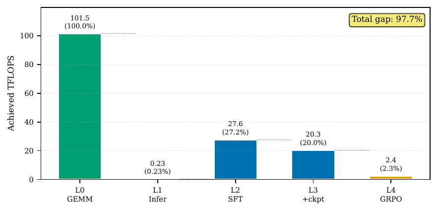
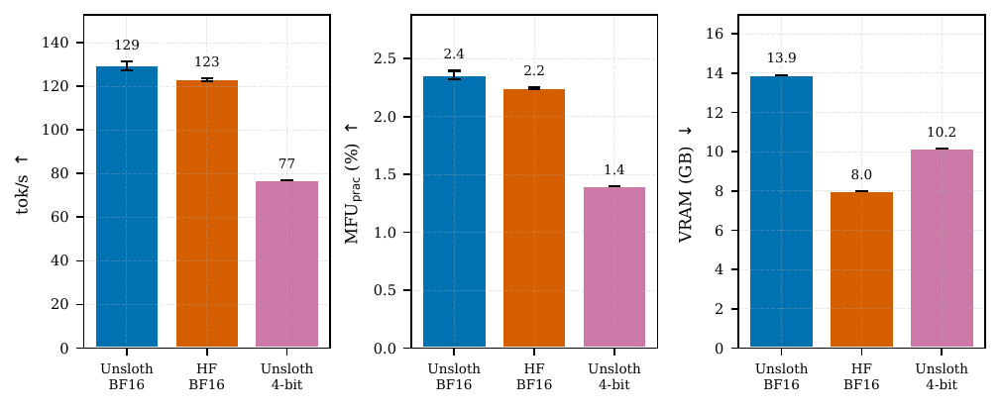
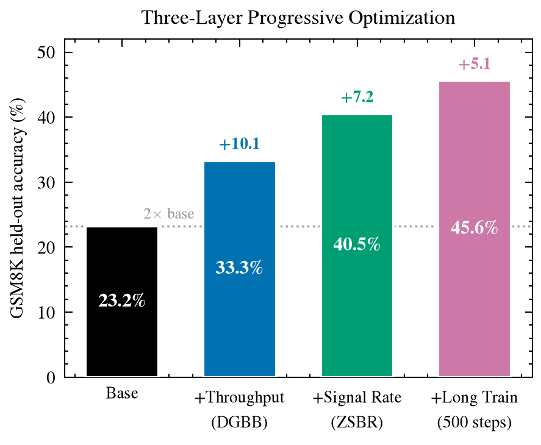
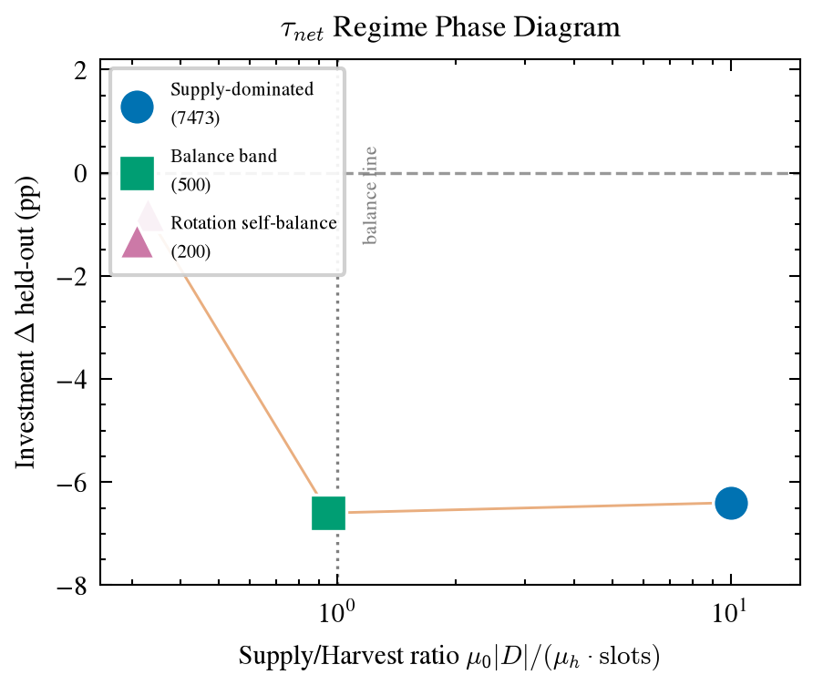
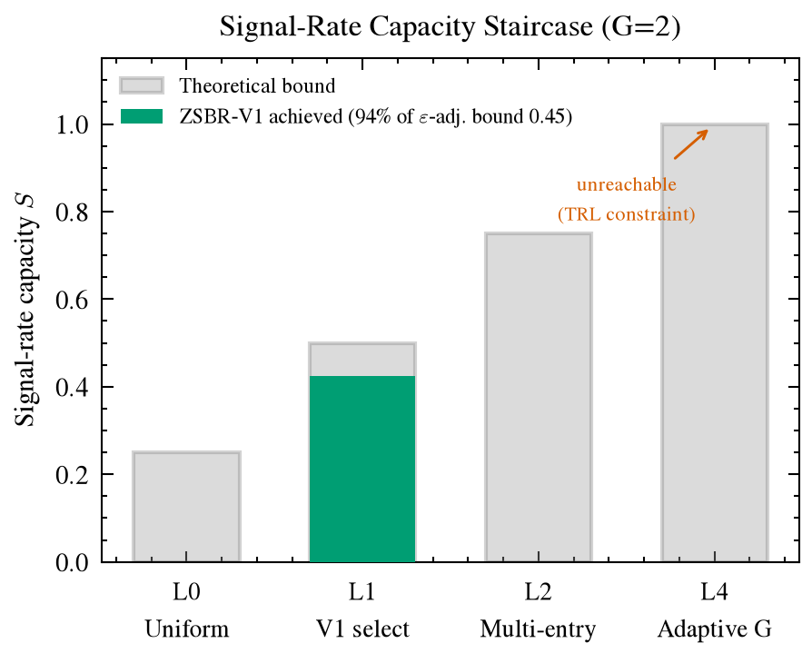

<a id="en"></a>

<div align="right">

**English | [中文](#zh)**

</div>

# LLM Post-Training Efficiency on Consumer AMD GPUs

Two companion papers that characterize and then optimize LLM post-training (GRPO/RLVR) on a **single consumer GPU** — an AMD RX 7900 XTX 24 GB (RDNA3, gfx1100) with ROCm 7.2, no cluster, no tensor parallelism. Paper 1 measures where the efficiency goes; Paper 2 turns those measurements into a three-layer optimization framework that doubles accuracy through pure RL on one card. Code, training data, and experiment artifacts are fully released.

| Paper | PDF | LaTeX | DOI | Pages |
|---|---|---|---|---|
| **P1** Characterizing and Optimizing LLM Post-Training Efficiency on Consumer AMD RDNA3 GPUs | [main.pdf](paper1/main.pdf) | [main.tex](paper1/main.tex) | [10.5281/zenodo.21695686](https://doi.org/10.5281/zenodo.21695686) | 15 |
| **P2** Three-Layer Progressive Optimization: Systematic Limit Approximation for Consumer-GPU GRPO Post-Training | [EN](paper2/paper_en.pdf) · [中文](paper2/paper_cn.pdf) | [paper_en.tex](paper2/paper_en.tex) · [paper_cn.tex](paper2/paper_cn.tex) | [10.5281/zenodo.21947489](https://doi.org/10.5281/zenodo.21947489) | 18 / 19 |

---

## Paper 1: Efficiency Characterization (the "where does the time go" paper)

**Research questions.** On consumer RDNA3 hardware, (RQ1) how large is the real speedup of optimized training frameworks (Unsloth) over the HuggingFace native path — is the widely reported 2× transferable from data-center GPUs? (RQ2) where exactly does the end-to-end efficiency gap come from — which component of the GRPO loop burns the throughput? (RQ3) which tuning levers actually matter, and what is the best configuration within the 24 GB memory wall?

**Experiments.** Single RX 7900 XTX + Qwen2.5-3B-Instruct (3.09B), LoRA GRPO on GSM8K: (a) framework A/B comparison under the same batch/memory regime; (b) component-stacking gap attribution — GEMM peak microbenchmarks → pure decoding → SFT (with/without gradient checkpointing) → full GRPO; (c) tuning sweeps over batch, sequence length, and generation count; (d) a dual-peak MFU methodology correcting the conventional single-peak bias.

**Key results.**

*Framework comparison (RQ1):*

| Framework | tok/s | Practical MFU | VRAM |
|---|---|---|---|
| Unsloth BF16 | 129.4 ± 2.6 | 2.36% | 13.9 GB |
| HF Native BF16 | 123.1 ± 0.8 | 2.24% | 8.0 GB |
| Unsloth 4-bit | 76.8 | 1.40% | 10.2 GB |

Unsloth's advantage is **+5.2%** — real but far below the 2× claimed on CDNA hardware; **4-bit quantization *reduces* throughput by 40.7%** on this architecture, inverting the NVIDIA narrative.

*Gap attribution (RQ2):*

| Stage | TFLOPS | Mechanism |
|---|---|---|
| L0: GEMM peak (measured) | 101.53 | Practical hardware limit |
| L1: Autoregressive inference | 0.23 | Bandwidth-bound (arithmetic intensity ≈ 1) |
| L2: SFT, no checkpointing | 27.63 | Batched forward+backward GEMM |
| L3: SFT, gradient checkpointing | 20.33 | Recompute overhead |
| L4: Full GRPO | 2.35 | Generation-dominated wall clock |
| **Total gap** | **−99.2 (97.7% loss)** | Inference is the bottleneck |



*Figure P1-a: end-to-end efficiency waterfall — autoregressive generation's bandwidth bottleneck dominates the 97.7% gap.*



*Figure P1-b: framework comparison and the tuning sweep landscape.*

*Tuning (RQ3):* sequence length and generation count are the dominant levers (+30% each); the combined optimum reaches 178.5 tok/s (+36% over defaults). The follow-up decoupled-batch sweep — Paper 2's Layer 1 — pushes this to **795.5 tok/s = 97.6% of the within-wall theoretical argmax**.

**Conclusions.** (1) Framework speedups do not transfer across architectures — measure, don't assume. (2) The efficiency loss is dominated by batch-1 decoding at 38% bandwidth utilization; the training step itself recovers to 27.2% practical MFU once adequately batched. (3) The conventional single-peak MFU metric carries a 17.3% systematic bias on tensor-core-less GPUs; the dual-peak method (and the open-source profiler released here) provides a fairer cross-architecture basis.

---

## Paper 2: Three-Layer Progressive Optimization (the "make it work" paper)

**Research question.** Can a single consumer GPU perform *effective* RLVR — and can we prove, layer by layer, that each layer's headroom is exhausted before descending to the next?

**Method.** Progressive limit approximation in three layers, each justified by the exhaustion of the previous one:

**Layer 1 — Throughput (DGBB, Decoupled-Generation Batch-Balancing).** Treat generation batch B_g and backward micro-batch B_b as two independent variables (TRL semantics make this free — no algorithm change). A three-parameter step-time law `T_step = a₁ + a₂·B_g + a₃·B_g/B_b` fits all 7 sweep points within ±3.3% residual (R² = 0.99); a pre-registered blind prediction exposed the real memory wall (spike + system terms, corrected wall (256, 384] tokens); a probe experiment *falsified* the naive extrapolation (pdb8 = pdb4). Measured optimum **795.5 tok/s = 97.6% of the wall argmax**; per-phase analysis shows the remaining 18% lives in kernels, not scheduling — *the batch dimension is exhausted*.

| Utilization level | tok/s | 6ND-MFU |
|---|---|---|
| Measured optimum (gen256) | **795.5** | 14.5% |
| Within-wall theoretical argmax | 815.3 | 14.9% |
| Asymptotic (no memory wall) | 864.8 | 15.8% |
| Zero micro-batch overhead (probe-refuted) | 939.0 | 17.2% |

**Layer 2 — Signal rate (ZSBR, Zero-Signal Budget Reallocation).** At G=2, **75% of generated groups have zero advantage** (measured frac_reward_zero_std = 0.75) — 75% of compute produces no gradient. ZSBR scores each prompt *before* generation with a closed-form Beta-posterior expectation `E[P_sig|D] = 2αβ/((α+β)(α+β+1))` and reallocates the fixed budget to boundary prompts. A controlled ablation proves the posterior is necessary (point estimator fails the gate at fzs 0.708; posterior passes at 0.575). ZSBR reaches **94% of the ε-adjusted G=2 capacity** (S = 0.425 vs. 0.45) at **zero throughput cost**.

| Arm (100 steps, 3 seeds) | Held-out | fzs (2nd half) |
|---|---|---|
| Uniform sampling | 32.7% ± 1.6 | 0.744 |
| **ZSBR-V1** | **40.5% ± 0.9** | **0.575** |
| Paired difference | **+7.8 pp, Cohen's d = 7.52** | — |

Effective signal groups/second improve 1.75×; ZSBR's seed dispersion *halves* versus uniform. Extending to 500 steps reaches the **45.6% milestone (228/500, 8.5 h pure RL on one card, 2× over the 23.2% base)**.



*Figure P2-a: the three-layer milestone ladder — each step justified by exhausting the previous layer.*

**Layer 3 — Dynamics (SFOC, Signal-Flux Optimal Control).** Training modifies the model, which modifies the prompt pool: hard → boundary → learned migration makes selection an *optimal control* problem on pool dynamics. A three-pool ODE model yields the **τ_net regime criterion** (`τ_net = |M| / (μ_h·slots − μ_0·|D|)`), with the relay rate μ₀ cross-validated on four independent paths (0.002 / 0.0053 / 0.0076 [CI 0.0066–0.0086] / 0.0081). The **Scheduler-Constraint Capping Theorem (proved)** shows that under cooldown-based greedy scheduling, effective harvest is capped at μ_h·(|M|/N)·M_b and depletion-dominated dynamics is *structurally unreachable* — which is why GRESO (cooldown-free, multi-epoch) observes decay while our runs plateau. A direct falsification test confirms it: removing cooldown breaks the pool-200 plateau (−15 pp fzs), while the balanced pool-500 regime holds (net −0.9 pp, equivalent held-out).

| Regime point | Pool | Supply μ₀\|D\| | Investment effect |
|---|---|---|---|
| Supply-dominated | 7473 | [6.1, 24.3] ≫ 1.37 | **−6.4 pp** (z = 2.05) |
| Balance band | 500 | [0.52, 2.1] ≈ 1.37 | **−6.6 pp** (p < 0.001) |
| Rotation balance | 200 | [0.18, 0.71] ≪ 1.37 | −0.8 pp (n.s., inertia) |

The investment mechanism was tested at all three points and is **never positive** — a monotone dose–response (flux −17% → −10.5% → +4.5%, the last being candidate exhaustion, not return). **Under G=2 and realistic scheduling, greedy selection is strictly optimal.**



*Figure P2-b: τ_net phase diagram (three empirical regime points) and the investment dose–response.*



*Figure P2-c: signal-rate capacity staircase — 94% of the honest bound reached.*

**Cross-architecture round (Gemma 4 E2B).** DGBB re-fits at R² = 0.9983 (form portable); ZSBR's transfer is negative but 4× variance-reducing (S₀-compression: E2B's baseline S₀ = 0.400 vs. Qwen's 0.25); τ_net's plateau structure transfers (parameters must be re-measured per base model).

**Conclusions.** 23.2% → 45.6% (2× pure-RL gain, single card, 8.5 h); **15× data efficiency** (500 well-chosen prompts ≈ full 7473 pool); the first explicit "when NOT to use curriculum" criterion; all 13 pre-registered falsifiable predictions converge to one self-consistent picture, with negative results (investment harm in three regimes) as the strongest evidence for the theory's predictive power. Methodological contributions: pre-registration/audit protocol (three rounds, last round zero-defect), Beta-binomial pool deconvolution (true boundary pool ≈ 2× observed), and a proved structural-impossibility theorem.

---

## Repository Contents

| Path | Contents |
|---|---|
| `paper1/` | P1 LaTeX source (`main.tex` + `sections/` + `tables/` + `figures/`), compiled PDF, `refs.bib` — independently compilable (pdflatex → bibtex → pdflatex ×2) |
| `paper2/` | P2 EN + CN LaTeX sources, both PDFs, figures (PNG+PDF), `gen_figs.py` (regenerates all figures from `results/` with SciencePlots) — EN: pdflatex, CN: xelatex + ctex |
| `train/` | Core training code: `train_gsm8k_grpo.py` (GRPO trainer, DGBB configs, safety gates), `zsbr_scheduler.py` (ZSBR-V1/V2/SFC scheduling, posterior scorer, cooldown, water-filling), `rewards.py` (rule-based GSM8K reward) |
| `eval/` | Evaluation & judgment scripts: `evaluate_gsm8k.py` (unified held-out protocol, per-item correctness for McNemar), `judge_*.py` (pre-registered verdict judges), `run_zsbr_ablation.py` (chained experiment driver), `fit_theory.py` / `measure_flux_params.py` / `analyze_signal_flux.py` (theory fitting & audit recomputation), sweep drivers for all P1 experiments |
| `utils/` | `logger.py`, `metrics.py`, `efficiency_profiler.py` (dual-peak MFU), `monitor_grpo.py` (training dashboard) |
| `configs/` | GRPO/SFT configs, DeepSpeed zero2 |
| `data/` | **Complete GSM8K training prompt pool** — 7473 problems in the exact prompt format used by the trainer, each with pool index and normalized ground-truth answer (see `data/DATA_README.md`) |
| `results/` | Evaluation JSONs, `reward_log.jsonl` trajectories, `timing.json`, `efficiency_report.json`, run READMEs — everything needed to recompute every number in both papers (checkpoints excluded) |
| `assets/` | README figures (P1 PNGs) |

**Path configuration.** No hardcoded absolute paths: `LLM_TRAINING_ROOT` (repo root, auto-detected) and `LLM_MODELS_DIR` (base models, default `~/models`).

## Quick Start

```bash
git clone https://github.com/ChenHongYu2026/llm-training-on-consumer-amd.git
cd llm-training-on-consumer-amd
python3 -m venv venv_torch211 --system-site-packages   # torch 2.11.0+rocm7.2 (2.12.1 has a broken expandable_segments)
# train (Paper 2 production config: gen128 + ZSBR-V1, ~60 s/step)
PYTORCH_CUDA_ALLOC_CONF=expandable_segments:True TWS_GEN_CHUNK=128 \
HSA_OVERRIDE_GFX_VERSION=11.0.0 HIP_VISIBLE_DEVICES=0 \
venv_torch211/bin/python train/train_gsm8k_grpo.py \
  --framework hf --zsbr v1 --per-device-batch 4 --grad-accum 32 \
  --num-generations 2 --max-completion-length 256 --max-steps 500 --seed 42
```

## Citation

```bibtex
@misc{chen2026characterizing,
  title  = {Characterizing and Optimizing LLM Post-Training Efficiency on Consumer AMD RDNA3 GPUs},
  author = {Chen, Hongyu}, year = {2026}, doi = {10.5281/zenodo.21695686}
}
@misc{chen2026threelayer,
  title  = {Three-Layer Progressive Optimization: Systematic Limit Approximation for Consumer-GPU GRPO Post-Training},
  author = {Chen, Hongyu}, year = {2026}, doi = {10.5281/zenodo.21947489}
}
```

## License

Code: MIT License. Data and papers: CC BY 4.0 (see the Zenodo records).

---

<a id="zh"></a>

<div align="right">

**[English](#en) | 中文**

</div>

# 消费级 AMD GPU 上的 LLM 后训练效率研究

两篇互为表里的论文：在**单张消费级 GPU**（AMD RX 7900 XTX 24 GB，RDNA3，ROCm 7.2，无集群、无张量并行）上先"测量效率去哪了"，再把测量变成三层递进优化框架，用单卡纯 RL 让准确率翻倍。代码、训练数据、实验工件全部开源。

| 论文 | PDF | LaTeX | DOI | 页数 |
|---|---|---|---|---|
| **论文1** 消费级 AMD RDNA3 GPU 上 LLM 后训练效率的表征与优化 | [main.pdf](paper1/main.pdf) | [main.tex](paper1/main.tex) | [10.5281/zenodo.21695686](https://doi.org/10.5281/zenodo.21695686) | 15 |
| **论文2** 三层递进优化：消费级单卡 GRPO 后训练的系统化极限逼近 | [英文](paper2/paper_en.pdf) · [中文](paper2/paper_cn.pdf) | [paper_en.tex](paper2/paper_en.tex) · [paper_cn.tex](paper2/paper_cn.tex) | [10.5281/zenodo.21947489](https://doi.org/10.5281/zenodo.21947489) | 18 / 19 |

---

## 论文1：效率表征（回答"时间花在哪了"）

**研究问题。**（RQ1）优化框架（Unsloth）相对 HuggingFace 原生路径在消费级 RDNA3 上的真实提速是多少——数据中心 GPU 上广为流传的 2× 是否可迁移？（RQ2）端到端效率损失到底来自 GRPO 循环的哪个环节？（RQ3）哪些调优杠杆真正有效，24 GB 显存墙内的最优配置是什么？

**做了什么实验。** 单卡 RX 7900 XTX + Qwen2.5-3B-Instruct（3.09B），GSM8K LoRA GRPO：（a）同 batch/显存口径下的框架 A/B 对照；（b）组件堆叠式缺口归因——GEMM 峰值微基准 → 纯解码 → SFT（开/关梯度检查点）→ 完整 GRPO；（c）batch/序列长度/生成组数的调优扫描；（d）修正传统单峰 MFU 偏差的双峰 MFU 方法学。

**关键结果。**

*框架对照（RQ1）：*

| 框架 | tok/s | 实用 MFU | 显存 |
|---|---|---|---|
| Unsloth BF16 | 129.4 ± 2.6 | 2.36% | 13.9 GB |
| HF 原生 BF16 | 123.1 ± 0.8 | 2.24% | 8.0 GB |
| Unsloth 4-bit | 76.8 | 1.40% | 10.2 GB |

Unsloth 的优势仅为 **+5.2%**——真实但远低于 CDNA 硬件上宣称的 2×；**4-bit 量化在这块卡上反而使吞吐下降 40.7%**，颠覆了 NVIDIA 平台上的叙事。

*缺口归因（RQ2）：*

| 环节 | TFLOPS | 机理 |
|---|---|---|
| L0：GEMM 峰值（实测） | 101.53 | 实用硬件极限 |
| L1：自回归推理 | 0.23 | 带宽受限（算术强度 ≈ 1） |
| L2：SFT 无检查点 | 27.63 | 批量化前向+反向 GEMM |
| L3：SFT 带检查点 | 20.33 | 重算开销 |
| L4：完整 GRPO | 2.35 | 生成主导墙钟 |
| **总缺口** | **−99.2（97.7% 损失）** | 推理是瓶颈 |


*图 P1-a：端到端效率瀑布——自回归生成的带宽瓶颈主导了 97.7% 的缺口。*


*图 P1-b：框架对照与调优扫描地形。*

*调优（RQ3）：* 序列长度与生成组数是主导杠杆（各 +30%）；组合最优达 178.5 tok/s（较默认 +36%）。后续的解耦批处理扫描——即论文2 的第 1 层——把吞吐推到 **795.5 tok/s = 墙内理论 argmax 的 97.6%**。

**结论。**（1）框架加速比不可跨架构迁移——要实测，不要假设。（2）效率损失由 batch-1 解码主导（带宽利用率仅 38%）；训练步本身在充分批量化后恢复到 27.2% 实用 MFU。（3）无专用张量核的 GPU 上，传统单峰 MFU 有 17.3% 的系统性偏差；双峰方法与开源 profiler 给出更公平的跨架构比较基础。

---

## 论文2：三层递进优化（回答"怎么把它做成"）

**研究问题。** 单张消费级显卡能否*有效*执行 RLVR——并且能否逐层证明"每层的空间已吃干"后再下沉到下一层？

**方法。** 三层递进极限逼近，每一层以上一层的穷尽为前提：

**第 1 层——吞吐（DGBB，解耦生成批处理平衡）。** 把生成 batch B_g 与反向微批 B_b 视为两个独立变量（TRL 语义使这一解耦免费——算法语义零改变）。三参数步时定律 `T_step = a₁ + a₂·B_g + a₃·B_g/B_b` 以 ±3.3% 残差拟合全部 7 个扫描点（R² = 0.99）；预注册盲预测暴露真实显存墙（尖峰+系统项，修正墙 (256, 384]）；探针实验*证伪*朴素外推（pdb8 与 pdb4 持平）。实测最优 **795.5 tok/s = 墙内 argmax 的 97.6%**；分相分析表明剩余 18% 在 kernel 层而非调度层——*批调度维度已被吃干*。

| 利用率层级 | tok/s | 6ND-MFU |
|---|---|---|
| 实测最优（gen256） | **795.5** | 14.5% |
| 墙内理论 argmax | 815.3 | 14.9% |
| 无显存墙渐近 | 864.8 | 15.8% |
| 微批开销归零（已被探针证伪） | 939.0 | 17.2% |

**第 2 层——信号率（ZSBR，零信号预算重分配）。** G=2 下实测 **75% 的生成组优势为零**（frac_reward_zero_std = 0.75）——75% 的算力不产生梯度。ZSBR 在*生成之前*用解析式 Beta 后验期望 `E[P_sig|D] = 2αβ/((α+β)(α+β+1))` 给每题打分，把固定预算重分配给边界题。受控消融证明后验评分的必要性（点估计 fzs 0.708 未过闸门；后验期望 0.575 通过）。ZSBR 以**零吞吐代价**达到 **G=2 ε 修正容量的 94%**（S = 0.425 vs. 0.45）。

| 臂（100 步，3 seed） | Held-out | fzs（后半程） |
|---|---|---|
| 均匀采样 | 32.7% ± 1.6 | 0.744 |
| **ZSBR-V1** | **40.5% ± 0.9** | **0.575** |
| 配对差 | **+7.8 pp，Cohen's d = 7.52** | — |

有效信号组/秒提升 1.75×；ZSBR 的 seed 离散较均匀采样*减半*。延长至 500 步达到 **45.6% 里程碑（228/500，单卡纯 RL 8.5 小时，为 base 23.2% 的 2 倍）**。


*图 P2-a：三层里程碑阶梯——每一步都由上一层的穷尽所论证。*

**第 3 层——动力学（SFOC，信号通量最优控制）。** 训练改变模型，模型改变题池：难→边界→已会的迁移使选择成为池动力学上的*最优控制*问题。三池 ODE 模型给出 **τ_net regime 判据**（`τ_net = |M| / (μ_h·slots − μ_0·|D|)`），relay 速率 μ₀ 经四条独立路径交叉验证（0.002 / 0.0053 / 0.0076 [CI 0.0066–0.0086] / 0.0081）。**调度约束封顶定理（已证明）**表明：带冷却的贪心调度下，有效收割被 μ_h·(|M|/N)·M_b 封顶，耗竭主导的动力学*结构性不可达*——这正是 GRESO（无冷却、多 epoch）观察到衰减而我们观察到平台的原因。直接证伪检验确认：移除冷却打破 pool-200 平台（fzs −15 pp），而平衡 regime 的 pool-500 保持不变（净 −0.9 pp，held-out 等价）。

| Regime 点 | 池 | 供给 μ₀\|D\| | 投资效应 |
|---|---|---|---|
| 补给主导 | 7473 | [6.1, 24.3] ≫ 1.37 | **−6.4 pp**（z = 2.05） |
| 平衡带 | 500 | [0.52, 2.1] ≈ 1.37 | **−6.6 pp**（p < 0.001） |
| 轮转平衡 | 200 | [0.18, 0.71] ≪ 1.37 | −0.8 pp（不显著，惰性化） |

投资机制在三个 regime 点全部检验、**无一正回报**——单调剂量响应（通量 −17% → −10.5% → +4.5%，末点为候选枯竭而非回报）。**G=2 与现实调度约束下，贪心选择严格最优。**


*图 P2-b：τ_net 相图（三个实测 regime 点）与投资剂量响应。*


*图 P2-c：信号率容量阶梯——达到诚实上界的 94%。*

**跨架构轮（Gemma 4 E2B）。** DGBB 以 R² = 0.9983 重新拟合（形式可迁移）；ZSBR 迁移为负但方差下降 4×（S₀ 压缩：E2B 基线 S₀ = 0.400 vs. Qwen 0.25）；τ_net 的平台结构可迁移（参数须按基座重测）。

**结论。** 23.2% → 45.6%（单卡纯 RL 翻倍，8.5 小时）；**15× 数据效率**（500 道精选题 ≈ 全池 7473 题）；首个显式"何时不需要课程学习"判据；13 条预注册可证伪预言收敛于同一自洽图景，负结果（三 regime 投资伤害）恰是理论预测力的最强证据。方法学贡献：预注册-审计协议（三轮，末轮零缺陷）、Beta-binomial 池反卷积（真实边界池 ≈ 观测 2×）、已证明的结构性不可能定理。

---

## 仓库内容

| 路径 | 内容 |
|---|---|
| `paper1/` | 论文1 LaTeX 源（`main.tex` + `sections/` + `tables/` + `figures/`）、编译后 PDF、`refs.bib`——可独立编译（pdflatex → bibtex → pdflatex ×2） |
| `paper2/` | 论文2 中英文 LaTeX 源、双 PDF、图表（PNG+PDF）、`gen_figs.py`（从 `results/` 用 SciencePlots 重生成全部图表）——英文 pdflatex，中文 xelatex + ctex |
| `train/` | 核心训练代码：`train_gsm8k_grpo.py`（GRPO 训练器、DGBB 配置、安全闸门）、`zsbr_scheduler.py`（ZSBR-V1/V2/SFC 调度、后验评分器、冷却、水填法）、`rewards.py`（规则奖励） |
| `eval/` | 评估与判定脚本：`evaluate_gsm8k.py`（统一 held-out 口径、逐题正确向量支持 McNemar）、`judge_*.py`（预注册判定器）、`run_zsbr_ablation.py`（链式实验驱动）、`fit_theory.py` / `measure_flux_params.py` / `analyze_signal_flux.py`（理论拟合与审计复算）、论文1 全部扫描驱动 |
| `utils/` | `logger.py`、`metrics.py`、`efficiency_profiler.py`（双峰 MFU）、`monitor_grpo.py`（训练仪表盘） |
| `configs/` | GRPO/SFT 配置、DeepSpeed zero2 |
| `data/` | **完整 GSM8K 训练 prompt 池**——7473 题，训练器实际使用的 prompt 格式，含池索引与归一化标准答案（见 `data/DATA_README.md`） |
| `results/` | 评估 JSON、`reward_log.jsonl` 轨迹、`timing.json`、`efficiency_report.json`、run 说明——复算两篇论文全部数字所需的一切（不含 checkpoint） |
| `assets/` | README 插图（论文1 PNG） |

**路径配置。** 无硬编码绝对路径：`LLM_TRAINING_ROOT`（仓库根，自动探测）与 `LLM_MODELS_DIR`（基座模型，默认 `~/models`）。

## 快速开始

```bash
git clone https://github.com/ChenHongYu2026/llm-training-on-consumer-amd.git
cd llm-training-on-consumer-amd
python3 -m venv venv_torch211 --system-site-packages   # torch 2.11.0+rocm7.2（2.12.1 的 expandable_segments 有 bug）
# 训练（论文2 生产配置：gen128 + ZSBR-V1，约 60 s/step）
PYTORCH_CUDA_ALLOC_CONF=expandable_segments:True TWS_GEN_CHUNK=128 \
HSA_OVERRIDE_GFX_VERSION=11.0.0 HIP_VISIBLE_DEVICES=0 \
venv_torch211/bin/python train/train_gsm8k_grpo.py \
  --framework hf --zsbr v1 --per-device-batch 4 --grad-accum 32 \
  --num-generations 2 --max-completion-length 256 --max-steps 500 --seed 42
```

## 引用

```bibtex
@misc{chen2026characterizing,
  title  = {Characterizing and Optimizing LLM Post-Training Efficiency on Consumer AMD RDNA3 GPUs},
  author = {Chen, Hongyu}, year = {2026}, doi = {10.5281/zenodo.21695686}
}
@misc{chen2026threelayer,
  title  = {Three-Layer Progressive Optimization: Systematic Limit Approximation for Consumer-GPU GRPO Post-Training},
  author = {Chen, Hongyu}, year = {2026}, doi = {10.5281/zenodo.21947489}
}
```

## 许可

代码：MIT License。数据与论文：CC BY 4.0（见各 Zenodo 记录）。
